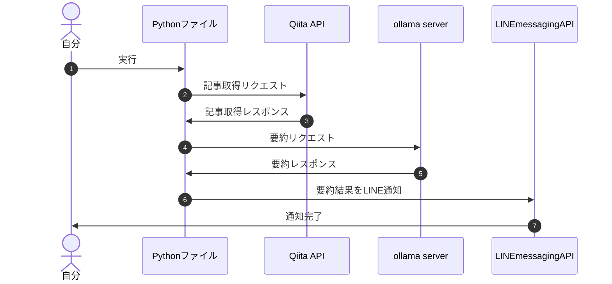

## 背景

こんにちは！株式会社ハウテレビジョンで外資就活ドットコムの開発をしているohiraです。

突然ですが、皆さんは日々の生活の中で技術ブログを読んでいますか？
私は正直、そこまで読めていません…。

でも、業務中やプライベートで技術的な課題に直面したときに、早く解決するためには「知見の引き出しの多さ」がとても重要だと感じています。その引き出しを増やすには、やはり技術ブログを定期的に読むことが有効ですよね。

とはいえ、業務時間外はどうしても趣味に時間を使ってしまいがちです。そこで、「通勤時間などのスキマ時間を活用して読もう！」と決意しても、気がつけば音楽や動画に夢中になってしまうことが多いんです…。

こうした課題を解決するために、「興味のある分野の技術ブログを要約し、それをLINE通知によって手軽に目にできる仕組み」を考えてみました。これならスキマ時間を活用して自然と技術ブログを読む習慣がつけられるはず！

### Qiita API × ローカルLLM × LINE通知で実現するアイデア
本記事では、以下のステップでこの仕組みを実現する方法をご紹介します。

1. Qiita APIを使って技術ブログを取得する
2. ローカルLLM（大規模言語モデル）で要約を生成する
3. 要約をLINE通知で届ける

## 実装

### シーケンス図


### Qiita API

Qiitaは公式でAPIを提供しているので、今回はそれを利用しました。

`query`を指定することで、特定の条件に合致する記事を取得することができます。

今回は、`LLM`タグがついた記事を取得するために`tag:LLM`を、昨日の記事を取得するために`created:>={yesterday} and created:<{today}`を指定しました。


```python
def fetch_qiita_articles():
    token = "token" # Qiita APIのアクセストークン
    url = f'https://qiita.com/api/v2/items'
    headers = {
        "Authorization":"Bearer " + token
    }
    today = datetime.datetime.now().strftime('%Y-%m-%d')
    yesterday = (datetime.datetime.now() - datetime.timedelta(days=1)).strftime('%Y-%m-%d')

    # LLMタグがついた昨日の間に作成された記事を取得
    query = f'tag:LLM and created:>={yesterday} and created:<{today}'
    params = {
        "page":1,
        "per_page":1,
        "query":query
    }
    res = requests.get(url,params = params,headers = headers)
    data = res.json()
    
    return data
```


### ローカルLLMで要約を生成する
今回ローカルLLMを選定した理由は、無料で利用したかったのと、単純に興味があって触ってみたかったからです。

環境構築は、同僚の開発ブログを参考にしました。
https://blog.howtelevision.co.jp/entry/2024/05/31/101918

モデルは、`Phi-3`を使用しました。
低容量なので処理が速い一方で、日本語を扱う上では精度が落ちるみたいなのですが、とりあえず試してみることにしました。
以下が実装例になります。

```python
def get_ollama_response(input):
    response = ollama.chat(model='phi3', messages=[
        {
            'role': 'system',
            'content': '必ず日本語で要約する。コードの部分は省略せずに残す。'
        },
        {
            'role': 'user',
            'content': '以下のLLMに関する技術ブログを日本語で要約してください。\n' + input["body"],
        },
    ])
    message = input["url"] + "\n"  + input["title"] + "の要約結果は以下の通りです。\n" + response['message']['content']
    return message
```

どこまでが命令で、どこからがブログの内容かが分かるように、systemロールには命令を実行してもらうときの制約を、userロールには要約してほしい文章のみを与えるようにしました。


### LINE通知
LINE通知をするための方法として、LINE Notifyというものがあるのですが、なんともうじきサービス終了とのことで、今回はLINE messaging APIを利用しました。

https://notify-bot.line.me/closing-announce

> 2016年9月から開発者の皆様に提供してまいりましたLINE Notifyですが、より良いサービスを提供するため、経営資源を後継の類似プロダクトに集中させることとなり、2025年3月31日にサービスを終了させていただくことになりました。LINEを用いた通知連携サービスとして、長年にわたり多くの皆様にご愛顧いただきましたこと、心より感謝申し上げます。

LINE messaging APIを利用するためには、LINE Developersに登録したり、アクセストークンを取得したりする必要があります。
こちらの記事が参考になりました。
https://qiita.com/yuzinet/items/58ec49cac3291e1ca8c0

アクセストークンやユーザーIDを取得したら、以下のような方法でLINE通知を送信することができます。

```python
def push(text):
  url = "https://api.line.me/v2/bot/message/push"
  headers = {
    "Content-Type" : "application/json; charset=UTF-8",
    'Authorization': 'Bearer ' + "{アクセストークン}"
  }

  postData = {
    "to" : "{ユーザーID}",
    "messages" : [
      {
        'type':'text',
        'text':text,
      }
    ]
  }

  return requests.post(url, headers=headers, data=json.dumps)
```

## 結果
以下のようなLINE通知を送ることに成功しました。


## 感想と今後の課題
今回は、Qiita APIを活用して技術ブログを取得し、ローカルLLMで要約を生成、LINE通知で届ける仕組みを作成しました。
この仕組みの最大の目的は、スキマ時間を活用して技術ブログを読む習慣をつけることです。

ただし、正直なところ、現在の完成度では「もっと読みたい！」と思えるレベルには至っていません…。
今後、以下の課題を解決しながら、より実用的で効果的な仕組みにブラッシュアップしていきたいと考えています。

- アウトプットの質を向上する
  - 要約の精度をさらに高める
  - モデルを変更することで、日本語の要約精度を向上させる
  - 読み手が直感的に理解しやすいフォーマットを模索する
- プログラムの自動実行を実現し、運用を効率化する
技術ブログを読む習慣を身につけることは、エンジニアとしての成長に直結します。この仕組みがその第一歩になれば嬉しいです。

## 参考記事
Qiita API
https://qiita.com/api/v2/docs
https://qiita.com/yonex/items/d3ade7c1ae9897536b28


ローカルLLM
https://zenn.dev/headwaters/articles/bf621b14fb688b
