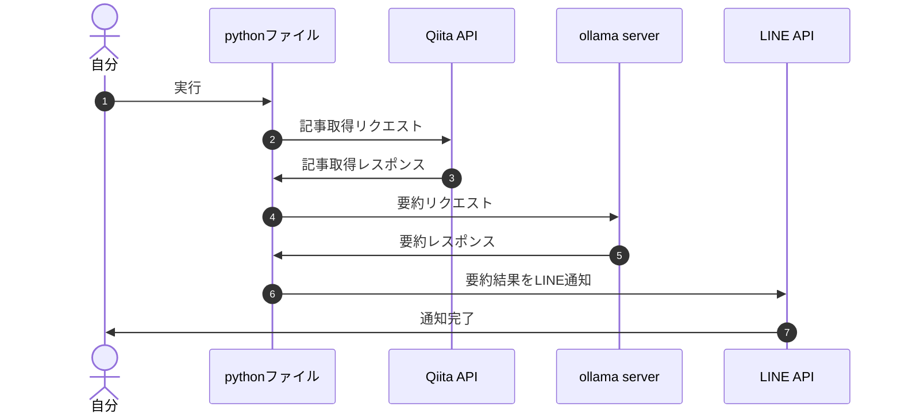

## 背景

こんにちは。株式会社ハウテレビジョンで外資就活ドットコムの開発をしているohiraです。
皆さんは日常的に技術ブログを読んでいますか？
私はあまり読めていません。
通勤時間などを利用して読むようには心がけてはいるのですが、音楽や動画に夢中になってしまうことが多いです。

そこで、興味のある分野の技術ブログのみを要約して目につきやすいLINE通知をすることで、技術ブログを読む習慣をつけようと思いました。
本記事では、Qiita APIを用いて技術ブログを取得し、ローカルLLMを用いて要約を行い、LINE通知をする方法を紹介します。

## シーケンス


## Qiita API

Qiitaは公式でAPIを提供しており、記事の取得や投稿が可能です。

`query`を指定することで、特定の条件に合致する記事を取得することができます。

今回は、`LLM`タグがついた記事を取得するために`tag:LLM`を、昨日の記事を取得するために`created:>={yesterday} and created:<{today}`を指定しました。


```python
def fetch_qiita_articles():
    token = "token" # Qiita APIのアクセストークン
    url = f'https://qiita.com/api/v2/items'
    headers = {
        "Authorization":"Bearer " + token
    }
    today = datetime.datetime.now().strftime('%Y-%m-%d')
    yesterday = (datetime.datetime.now() - datetime.timedelta(days=1)).strftime('%Y-%m-%d')

    # LLMタグがついた昨日の間に作成された記事を取得
    query = f'tag:LLM and created:>={yesterday} and created:<{today}'
    params = {
        "page":1,
        "per_page":1,
        "query":query
    }
    res = requests.get(url,params = params,headers = headers)
    data = res.json()
    
    return data
```


## ollama server
今回ローカルLLMを選定した理由は、無料で利用したかったのと、単純に触ってみたかったからです。

環境構築は、同僚の開発ブログを参考にしました。
https://blog.howtelevision.co.jp/entry/2024/05/31/101918

モデルは、`Phi-3`を選定しました。
低容量なので処理が速く、そのうえ精度も高いとのことで、今回の開発には十分だと判断しました。

```python
def get_ollama_response(input):
  response = ollama.chat(model='phi3', messages=[
    {
        'role': 'user',
        'content': '以下のLLMに関する技術ブログを300文字以内の日本語で要約してください。\n' + "要約して欲しい記事のタイトルは「"+ input["title"] + '」です。\n' + "要約して欲しい記事の内容は「" + input["body"] + '」です。',
    },
  ])
  return response
```


## 


## 参考記事
Qiita API
- https://qiita.com/api/v2/docs
- https://qiita.com/yonex/items/d3ade7c1ae9897536b28


ローカルLLM
- https://zenn.dev/headwaters/articles/bf621b14fb688b