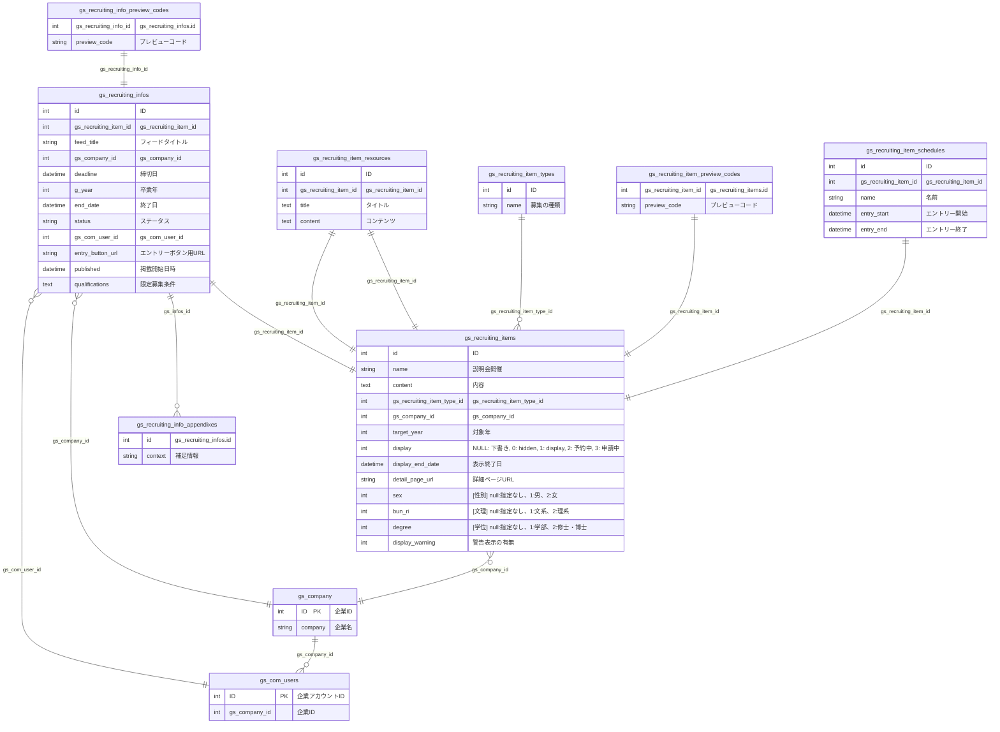
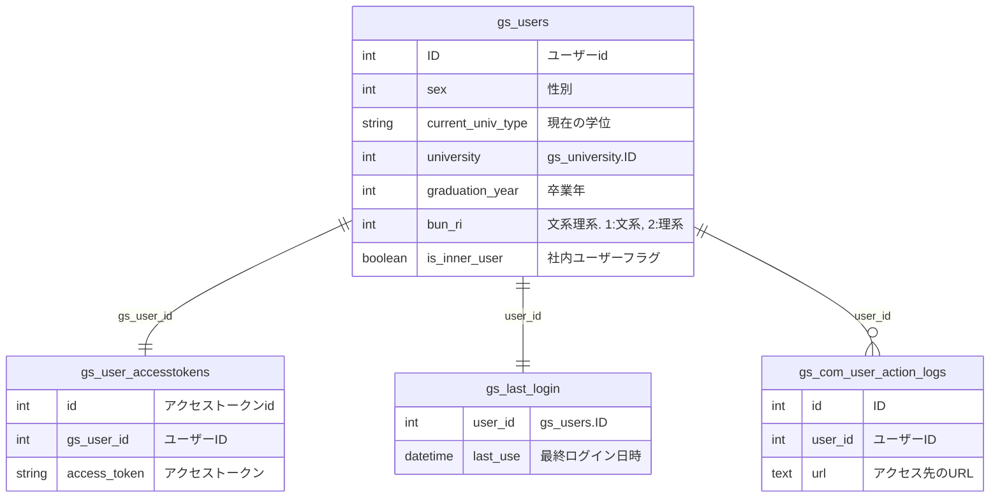

## 背景

こんにちは。株式会社ハウテレビジョンで外資就活ドットコムの開発をしているohiraです。

<!-- 私は、弊社に入社してから約1年半の間、技術負債解消を主な業務とするチームに所属し、cakePHPで書かれていた外資就活ドットコムのコードをフロントエンドはNext.js、バックエンドはGo言語に書き換えるプロジェクトなどに携わってきました。そして、遂に今年の夏頃にユーザーが使う画面のリプレイスを完了させることができました。 -->

私は、弊社に入社してから約2年間、技術負債解消を主な業務とするチームに所属し、ユーザーが使う画面のリプレイスなどをやってきましたが、この先外資就活ドットコムの成長に貢献するためには、新しい技術を取り入れていくことが必要だと考えています。
そこで、今更ではありますが、まずはプロンプトエンジニアリングのノウハウを身につけようと思いました。


## ゴール
LLMを用いてLLMに関する記事の要約をする。

## 要約システムの全体像



### ユーザー
| テーブル名 | テーブルの概要 | 
| -------- | -------- | 
| gs_users | ユーザーの基本情報 | 
| gs_user_accesstokens | ユーザーごとのアクセストークン|
| gs_last_login | ユーザーのログイン情報 |  
| gs_user_action_logs | ユーザーのアクションログ | 



## シーケンス
```plantuml
@startuml
actor User
participant "Webブラウザ" as Browser
participant "サーバ" as Server
participant "LLMシステム" as LLMSystem

User -> Browser: 記事の要約をリクエスト
Browser -> Server: 要約リクエストを送信
Server -> LLMSystem: 要約生成リクエスト
LLMSystem -> Server: 要約結果を返す
Server -> Browser: 要約結果を返す
Browser -> User: 要約結果を表示
@enduml


